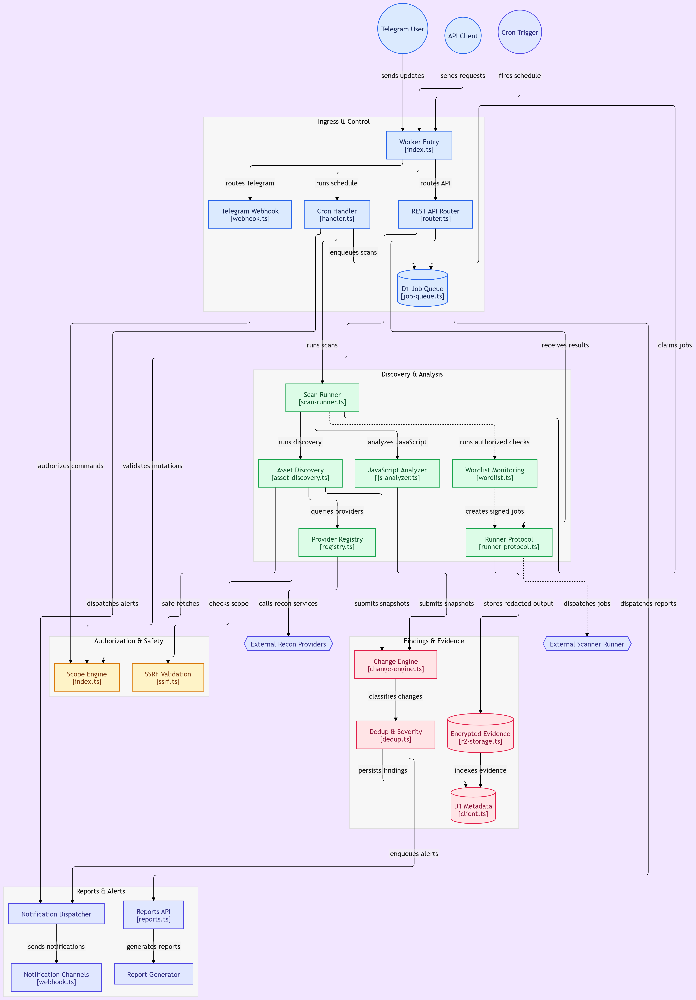

# Watchtower

Production-ready cybersecurity asset-monitoring platform built as a Telegram bot on Cloudflare Workers **FREE tier**.

> **v3.0.0-free** — runs entirely on Cloudflare's free plan. Queues and Durable Objects have been replaced with D1-backed equivalents (job_queue table, emergency_stop_state table, rate_limits_v2 table, locks table). A single Cron Trigger dispatches everything every 5 minutes via `ctx.waitUntil()`. Same automatic alerting, same 16 alert types, zero monthly cost. See [CHANGELOG.md](./CHANGELOG.md).

## What it does

Watchtower continuously monitors **authorized** targets for security-relevant changes:

- Certificate Transparency (crt.sh, Cert Spotter, crtndstry)
- DNS records (A, AAAA, CNAME, MX, NS, TXT, SOA, CAA, SRV, HTTPS)
- Subdomain discovery
- HTTP/HTTPS service probing (titles, headers, security headers, redirects)
- JavaScript file discovery + hashing + endpoint extraction + secret redaction
- API endpoint discovery (OpenAPI, Swagger, JS extraction, robots/sitemap)
- Technology fingerprinting
- CVE/vulnerability correlation (OSV, NVD)
- Wordlist-based change monitoring (authorization-gated, disabled by default)

## Design principles

- **Secure by default** — passive reconnaissance only until explicitly enabled
- **Human in the loop** — intrusive checks require explicit human approval
- **Explicit authorization** — no target is scanned without recorded authorization
- **No arbitrary command execution** — Telegram never executes shell commands
- **No automatic exploitation** — observations only
- **No destructive testing** — never DoS, never exfiltrate, never persist
- **Bounded memory** — every provider caps response sizes; unbounded JSON is rejected
- **Bounded concurrency** — D1-backed per-target locks + per-key rate limiters (free-tier replacement for Durable Objects)
- **Complete auditability** — every command, scan, finding mutation, evidence access is logged
- **Multi-tenant isolation** — every DB query is org-scoped
- **Safe failure behavior** — emergency stop is fail-closed; provider errors never become asset removals

## Architecture

```
┌──────────────────────────────────────────────────────────────────────────┐
│                          Cloudflare Worker                               │
│                                                                          │
│  ┌──────────┐    ┌──────────┐    ┌──────────┐    ┌──────────┐            │
│  │ Telegram │    │ REST API │    │ Cron     │    │ Queue    │            │
│  │ webhook  │    │ /v1/*    │    │ Triggers │    │ Consumer │            │
│  └────┬─────┘    └────┬─────┘    └────┬─────┘    └────┬─────┘            │
│       │               │               │               │                  │
│       └───────────────┴───────────────┴───────────────┘                  │
│                            │                                             │
│                  ┌─────────┴─────────┐                                   │
│                  │  Scope Engine     │  (SSRF + redirect + redaction)    │
│                  │  + Audit Logger   │                                   │
│                  └─────────┬─────────┘                                   │
│                            │                                             │
│    ┌────────────┬──────────┴──────────┬─────────────┐                    │
│    │            │                     │             │                    │
│   D1           R2                   KV        Durable Objects            │
│  (metadata)   (evidence)        (cache)   (locks/rate/estop)             │
│                                                                          │
│   ┌────────────┬──────────┬───────────┬───────────┬───────────┐          │
│   │ crt.sh     │ Cert     │ DNS-over- │ HTTP      │ OSV       │          │
│   │            │ Spotter  │ HTTPS     │ (Worker)  │           │          │
│   └────────────┴──────────┴───────────┴───────────┴───────────┘          │
│                                                                          │
│   Scanner-runner protocol (HMAC-signed jobs):                            │
│     nmap | subfinder | amass | httpx | nuclei | zap | burp               │
│   ─────────────────────────────────────────────────────                  │
│                       ↓ external runner                                  │
│   container / Cloud Run / Fly.io / Lambda / GitHub Actions               │
└──────────────────────────────────────────────────────────────────────────┘
```

Heavy scanners (nmap, nuclei, subfinder, amass, ZAP, Burp) **cannot run inside Cloudflare Workers**. They are dispatched to authorized external runners via signed job payloads. The Worker only orchestrates.

## Project structure

```
watchtower/
├── src/
│   ├── index.ts                      # Worker entry — fetch/scheduled/queue
│   ├── env.ts                        # typed Env bindings
│   ├── constants.ts                  # limits, severities, blocked CIDRs
│   ├── types.ts                      # domain models + command catalogue
│   ├── lib/                           # v2 hardened foundation
│   │   ├── errors.ts                  # 30+ typed error codes + HTTP status map
│   │   ├── logger.ts                  # structured JSON logger with redaction
│   │   └── redact.ts                   # 16 secret patterns + SALTED fingerprints
│   ├── scope/                         # v2 hardened scope engine (928 lines)
│   │   ├── match.ts                   # evaluateScope — control-proof hosts, reserved
│   │   │                              # domains, port/path/method/scheme rules, state-changing
│   │   │                              # method gating, IPv6 ULA/multicast/link-local blocking
│   │   ├── loader.ts                  # fail-closed D1 loader
│   │   └── index.ts                   # legacy-compatible API surface
│   ├── crypto/                        # hash, hmac, aes-gcm
│   ├── security/                      # thin shims that re-export lib/ + scope/
│   │   ├── scope.ts                   # → src/scope/index.ts
│   │   ├── redaction.ts               # → src/lib/redact.ts
│   │   ├── ssrf.ts                    # SSRF-safe fetch with DoH resolution
│   │   ├── redirect.ts                # redirect destination validation
│   │   └── validation.ts              # input validation primitives
│   ├── do/
│   │   ├── emergency-stop.ts          # fail-closed DO state
│   │   ├── lock.ts                    # distributed lock (ScopeLock)
│   │   ├── rate-limiter.ts            # sliding-window + backoff (RateLimiter)
│   │   └── job-coordinator.ts         # per-target job counter (JobCoordinator)
│   ├── queues/
│   │   ├── scan-consumer.ts           # runs discovery pipeline
│   │   └── notification-consumer.ts   # dispatches alerts
│   ├── cron/handler.ts                # scheduled monitoring (5 crons)
│   ├── telegram/                      # webhook, 44 commands, messages
│   ├── api/
│   │   ├── router.ts                  # REST + auth + audit
│   │   └── routes/                    # targets, findings, reports, webhooks
│   ├── providers/
│   │   ├── ct/{crtsh,certspotter,crtndstry}.ts
│   │   ├── dns/doh.ts
│   │   ├── http/httpx-adapter.ts
│   │   ├── scanners/runner-protocol.ts  # signed job/result payloads
│   │   └── cve/osv.ts
│   ├── modules/
│   │   ├── asset-discovery.ts         # CT + DNS + HTTP pipeline
│   │   ├── js-analyzer.ts             # JS fetch/hash/diff/extract
│   │   ├── change-engine.ts           # snapshot diffing
│   │   ├── dedup.ts                   # finding fingerprinting + merge
│   │   ├── severity.ts              # CVSS + EPSS + priority scoring
│   │   ├── wordlist.ts               # 8 scan profiles, sanitization, runner
│   │   └── report-generator.ts       # markdown/json/hackerone/bugcrowd/etc.
│   ├── notifications/                # telegram/slack/email/jira/github/webhook
│   ├── evidence/r2-storage.ts        # AES-GCM encrypted R2 + signed URLs
│   ├── audit/logger.ts               # D1 audit + console structured logger
│   └── utils/                        # domain, ip, url, punycode
├── migrations/                       # 10 incremental migrations (v2 split)
│   ├── 0001_initial.sql              # orgs, users, roles, targets, scopes, audit
│   ├── 0002_assets.sql               # assets, dns_records, certificates, services
│   ├── 0003_javascript_api.sql       # js_files, js_diffs, api_endpoints, source_maps
│   ├── 0004_scans_findings.sql       # scans, scan_jobs, scan_results, findings, evidence
│   ├── 0005_changes_notify.sql      # changes, notifications, alert_rules
│   ├── 0006_runners.sql             # runners, runner_jobs, runner_heartbeats
│   ├── 0007_wordlists_reports.sql   # wordlists, wordlist_entries, reports
│   ├── 0008_seed.sql                # default roles + capabilities
│   ├── 0009_provider_defaults.sql   # provider adapter config
│   └── seed_authorized_example.sql  # example target bootstrap
├── test/                             # 18 vitest suites (v1 + v2 hardened)
├── docs/
│   ├── openapi.yaml
│   ├── architecture.md
│   ├── threat-model.md
│   ├── incident-response.md
│   └── data-retention.md
├── examples/authorized-config.example.json
├── fuzz-wordlists/                   # sample wordlists
├── scripts/deploy.sh
├── DEPLOYMENT.md
├── SECURITY.md
└── wrangler.toml
```

## Quick start

```bash
# 1. Install
npm install

# 2. Configure
cp .env.example .dev.vars
# Edit .dev.vars with bot token, webhook secret, encryption key, HMAC key, REDACTION_SALT

# 3. Create D1 database + KV namespace (FREE TIER — no R2, no queues, no DOs)
#    R2 is OPTIONAL on the free tier — requires payment method on file.
#    Watchtower automatically falls back to D1 BLOB storage when R2 is not bound.
npx wrangler d1 create watchtower-db
npx wrangler kv:namespace create CACHE
# Optional (only if you have a payment method on file):
#   npx wrangler r2 bucket create watchtower-evidence
#   npx wrangler r2 bucket create watchtower-reports

# 4. Apply DB migrations (12 incremental files — 0001..0011 + seed)
npx wrangler d1 migrations apply watchtower-db --remote

# 5. Set secrets
npx wrangler secret put TELEGRAM_BOT_TOKEN
npx wrangler secret put TELEGRAM_WEBHOOK_SECRET
npx wrangler secret put AUTHORIZED_TELEGRAM_IDS
npx wrangler secret put ENCRYPTION_KEY
npx wrangler secret put REDACTION_SALT   # NEW in v2 — required for salted fingerprints
npx wrangler secret put API_HMAC_KEY
npx wrangler secret put WEBHOOK_SIGNING_SECRET
npx wrangler secret put RUNNER_REGISTRY_TOKEN

# 6. Deploy
npx wrangler deploy

# 7. Register the Telegram webhook (POST to your deployed worker)
curl -X POST https://watchtower.YOUR-SUBDOMAIN.workers.dev/telegram?secret=$TELEGRAM_WEBHOOK_SECRET \
  -H "content-type: application/json" \
  -d '{"update_id":1,"message":{"message_id":1,"chat":{"id":123456,"type":"private"},"text":"/start","date":0,"from":{"id":123456,"is_bot":false,"first_name":"Operator"}}}'
```

## Authorization

Every target requires explicit authorization before scanning. The bot refuses
to run any scan until:

1. The operator runs `/authorize <target> <reference>` with a written contract
   reference, signed permission letter URL, or bug-bounty program identifier.
2. The operator adds scope entries via `/scope_add <target_id> <type> <value>`.
3. The authorization expires on the date provided via `/target_add`.

Out-of-scope assets discovered through CT logs are **recorded** with
`scope_status='out_of_scope'` for forensic visibility but are **never** probed.

## Emergency stop

`/stop global` immediately cancels all queued and running scans and blocks
new scans for 24 hours. Per-organization, per-target, and per-job scopes are
also supported. `/resume` lifts the stop.

## Automatic alerts

Watchtower automatically sends you a Telegram alert whenever it detects a new
asset or a change on any in-scope target. No manual triggering required — the
cron handler enqueues a passive scan every 5 minutes, and the scan consumer
collects `Alert` objects for every discovery, then enqueues each one to
`NOTIFY_QUEUE` which delivers the Telegram message.

### Alert types

The scan consumer emits alerts for the following events:

| Alert type | Severity | Trigger |
|---|---|---|
| `new_subdomain` | medium | CT log provider (crt.sh, Cert Spotter, crtndstry) returns a hostname not previously seen |
| `new_ip` | medium | DNS resolution returns an IP not previously recorded |
| `new_certificate` | high | A new TLS certificate serial is observed in CT logs |
| `new_dns_record` | low | A new DNS record (A/AAAA/CNAME/MX/NS/TXT/SOA/CAA/SRV/HTTPS) appears |
| `new_service` | medium | An in-scope HTTP(S) endpoint responds successfully for the first time |
| `new_technology` | low | A new technology is fingerprinted on an in-scope HTTP asset |
| `technology_version_changed` | medium | A technology's detected version changes |
| `service_title_changed` | low | The HTML `<title>` of an HTTP asset changes |
| `service_status_changed` | medium | The HTTP status code of a previously-seen endpoint changes |
| `service_header_changed` | low | The `Server` header of an HTTP asset changes |
| `new_javascript_file` | medium | A new `<script src>` reference is discovered in HTML |
| `javascript_changed` | low | A previously-seen JS file's SHA-256 hash changes (deployment indicator) |
| `new_api_endpoint` | medium | A new endpoint-like path is extracted from a JS file (`/api/v1/users`, `/graphql`, etc.) |
| `new_secret_candidate` | high | A high-confidence secret pattern (AWS key, JWT, private key, etc.) is detected in a JS file |
| `scan_completed` | informational | A scan finished successfully (visible in audit log; not pushed to Telegram by default) |
| `scan_failed` | high | A scan failed with an error — operator attention required |

### Timing

| Stage | Latency |
|---|---|
| Cron tick → scan enqueued | up to 5 minutes (cron cadence) |
| Scan consumer starts → first alert enqueued | ~5–30 seconds (CT providers run in parallel) |
| Notification queue → Telegram message delivered | ~1–5 seconds |
| **Total: change happens on target → Telegram alert** | **typically 5–10 minutes** |

The first scan after `/target_add` produces a flood of `new_*` alerts (every
discovered asset is "new"). Subsequent scans only alert on **delta** — assets
not previously seen, or assets whose state changed.

### Deduplication

Every alert carries a deterministic `dedup_key` of the form
`<alert_type>:<target_id>:<asset_value>`. The notification consumer suppresses
any notification whose `dedup_key` matches one already sent in the last 24
hours. This means:

- Discovering the same subdomain on two consecutive scans → **1 alert**, not 2
- A JS file that changes once and then stays the same → **1 alert** on the change, 0 on the next scan
- A secret candidate that's still present → **1 alert** the first time, 0 thereafter

### Telegram alert format

Each alert renders as:

```
🚨 [HIGH] New TLS certificate issued for api.example.com

Target: example.com
Change type: new_certificate
Issuer: Let's Encrypt
Serial: 03:ab:cd:...
Valid from: 2026-09-20T12:00:00Z
Valid until: 2026-12-19T12:00:00Z
Source: crt.sh

Use /diff_latest to see all recent changes or /finding_details to inspect a specific finding.
```

Severity → emoji mapping:
- 🚨 `critical`
- ⚠️ `high`
- 📋 `medium`
- ℹ️ `low`
- 📌 `informational`

### What is NOT alerted on

To avoid false positives, Watchtower **does not** alert when:

- An out-of-scope asset is discovered (it's recorded with `scope_status='out_of_scope'` for forensic visibility, but never probed or alerted)
- A provider returns the same data as last time (no delta)
- A scan is skipped due to emergency stop (already a separate emergency-stop alert)
- A target's authorization is expired (the cron handler sends a separate scope-expiry warning instead)

Removed assets (subdomain that disappeared from CT, JS file that was deleted)
are **not currently alerted** — detecting removals safely requires the
provider to explicitly return an empty result, and provider outages shouldn't
be mistaken for asset removal. This is documented as a known limitation.

## Telegram bot commands

Watchtower exposes **44 commands** via Telegram. All commands are audited,
RBAC-enforced, and refuse to run if the caller is not in `AUTHORIZED_TELEGRAM_IDS`.
The command router accepts both `/scope_add` (underscore form) and
`/scope add` (space-separated form).

### Onboarding & authorization

| Command | Args | Description |
|---|---|---|
| `/start` | — | Initialize the bot. Sends the welcome screen with quick-start instructions. Always allowed (even before authorization). |
| `/help` | — | List every available command grouped by category. |
| `/authorize` | `<target_name> <reference>` | Record written authorization for a target. `reference` must be a contract ID, signed-permission URL, or bug-bounty program identifier. **Required** before any scan can run. |

Example:
```
/authorize example.com WRITTEN-CONTRACT-2026-001
/authorize api.acme-corp.com https://bugbounty.acme.com/rules
```

### Scope management

Scope entries are the allowlist/denylist of hosts, IPs, CIDRs, URLs, APIs,
repositories, cloud accounts, and mobile apps that may be monitored for a
target. Default-deny: nothing is scanned unless an allowlist entry matches.

| Command | Args | Description |
|---|---|---|
| `/scope_add` | `<target_id> <type> <value> [--exclude]` | Add a scope entry. `type`: `domain` · `wildcard_domain` · `ip` · `cidr` · `url` · `api` · `repository` · `cloud_account` · `mobile_app`. `--exclude` marks it as a denylist entry. |
| `/scope_list` | `<target_id>` | List all scope entries for a target, showing included/excluded and paused state. |
| `/scope_update` | `<scope_id> <new_value>` | Update the value of an existing scope entry. |
| `/scope_remove` | `<scope_id>` | Permanently delete a scope entry. |
| `/scope_pause` | `<scope_id>` | Temporarily deactivate a scope entry without deleting it. |
| `/scope_resume` | `<scope_id>` | Reactivate a paused scope entry. |
| `/scope_expire` | `<scope_id>` | Mark a scope entry as expired (sets `expires_at` to now). |

Examples:
```
/scope_add TGT_abc wildcard_domain *.example.com
/scope_add TGT_abc domain internal.example.com --exclude
/scope_add TGT_abc cidr 192.0.2.0/24
/scope_add TGT_abc url https://api.example.com/v1/
```

### Target management

| Command | Args | Description |
|---|---|---|
| `/target_add` | `<org_id> <name> <expires YYYY-MM-DD> [program_rules_url]` | Create a new monitoring target. Authorization expiry is mandatory. |
| `/target_list` | `<org_id>` | List all targets in an organization with their paused/expired state. |
| `/target_details` | `<target_id>` | Show full target metadata: scan mode, rate limits, concurrency, authorization, scope summary. |
| `/target_pause` | `<target_id>` | Pause all monitoring for a target (cancels in-flight scans). |
| `/target_resume` | `<target_id>` | Resume monitoring for a paused target. |

Example:
```
/target_add ORG_main example.com 2099-12-31 https://bugbounty.example.com/rules
```

### Scans

| Command | Args | Description |
|---|---|---|
| `/scan_passive` | `<target_id>` | Queue a passive scan (CT logs + DNS + safe HTTP probing + JS analysis). No intrusive checks. |
| `/scan_active` | `<target_id> confirm` | Enable low-impact active scanning for a target. **Requires explicit `confirm` argument** as human approval. Intrusive checks remain blocked unless separately approved. |
| `/scan_status` | `<scan_id>` | Show the current status, profile, timestamps, and any error for a scan. |
| `/scan_cancel` | `<scan_id>` | Cancel a queued or running scan. Triggers a per-job emergency stop. |
| `/scan_history` | `<target_id>` | Show the last 20 scans for a target with status and timestamp. |

Examples:
```
/scan_passive TGT_abc
/scan_active TGT_abc confirm
/scan_cancel SCAN_xyz123
```

### Findings

| Command | Args | Description |
|---|---|---|
| `/findings_list` | `<org_id> [status] [severity]` | List findings, optionally filtered by status (`open` · `assigned` · `in_review` · `resolved` · `closed` · `reopened`) and severity (`informational` · `low` · `medium` · `high` · `critical`). |
| `/finding_details` | `<finding_id>` | Show full finding metadata: severity, CVSS, EPSS, CWE, CVE, OWASP, affected URL, confidence, detection source, verification state. |
| `/finding_verify` | `<finding_id>` | Mark a finding as `verified` and move to `in_review` status. |
| `/finding_reject` | `<finding_id>` | Mark a finding as `false_positive` and close it. |
| `/finding_assign` | `<finding_id> <user_id>` | Assign a finding to a teammate. Moves to `assigned` status. |
| `/finding_close` | `<finding_id>` | Close a finding. |
| `/finding_reopen` | `<finding_id>` | Reopen a previously closed finding. Resets verification state to `detected`. |

Examples:
```
/findings_list ORG_main open high
/finding_assign FND_xyz USR_alice
/finding_verify FND_xyz
```

### Reports & diffs

| Command | Args | Description |
|---|---|---|
| `/report_create` | `<target_id> <format>` | Generate a report. `format`: `markdown` · `json` · `pdf` · `hackerone` · `bugcrowd` · `internal` · `executive`. Stored in R2 with content hash. |
| `/report_export` | `<report_id>` | Show report metadata and R2 key. Use the REST API to download via a short-lived signed URL. |
| `/diff_latest` | `<target_id>` | Show the latest 20 changes detected for a target. |
| `/diff_compare` | `<target_id> <older_scan_id> <newer_scan_id>` | Compare two snapshots. Use the API to retrieve the full diff. |

Examples:
```
/report_create TGT_abc hackerone
/diff_latest TGT_abc
```

### Alerts & schedules

| Command | Args | Description |
|---|---|---|
| `/alerts_enable` | `<target_id>` | Enable Telegram alerts for a target. |
| `/alerts_disable` | `<target_id>` | Disable alerts for a target. |
| `/schedule_add` | `<target_id> <cron_expr> <profile>` | Add a monitoring schedule. `cron_expr` is standard 5-field cron (UTC). `profile` is one of the 8 scan profiles (see below). |
| `/schedule_list` | `<target_id>` | List all schedules for a target with next-run time. |
| `/schedule_remove` | `<schedule_id>` | Delete a schedule. |

Examples:
```
/alerts_enable TGT_abc
/schedule_add TGT_abc "0 * * * *" passive-only
/schedule_add TGT_abc "0 0 * * *" javascript-monitoring
```

### Integrations & team

| Command | Args | Description |
|---|---|---|
| `/integration_add` | `<org_id> <type> [config_json]` | Add a notification integration. `type`: `slack` · `jira` · `github` · `email` · `webhook`. `config_json` is a JSON object with channel/project/recipients. |
| `/integration_remove` | `<integration_id>` | Remove an integration. |
| `/team_invite` | `<org_id> <telegram_id> [role]` | Invite a teammate. `role`: `viewer` (default) · `analyst` · `administrator` · `owner` · `external_reviewer`. |
| `/team_members` | `<org_id>` | List all members of an organization with their roles. |

Examples:
```
/integration_add ORG_main slack {"channel":"#security-alerts"}
/team_invite ORG_main 987654321 analyst
```

### Operations

| Command | Args | Description |
|---|---|---|
| `/settings` | — | Show current Watchtower configuration: env, rate limits, retention, scan-mode defaults. |
| `/audit` | `<org_id> [action]` | Show the last 20 audit log entries, optionally filtered by action name (e.g. `telegram.command.scan_passive`). |
| `/stop` | `[scope] [id] [reason...]` | **EMERGENCY STOP.** `scope`: `global` (default) · `organization` · `target` · `job`. Cancels all in-flight scans for the affected scope and blocks new scans for 24h. |
| `/resume` | `[scope] [id]` | Lift an emergency stop for the given scope. |

Examples:
```
/stop global suspected compromise — investigating
/stop target TGT_abc false-positive spike
/resume target TGT_abc
/audit ORG_main telegram.command
```

### Scan profiles

The 8 profiles that can be passed to `/schedule_add` and `/scan_passive`:

| Profile | Description |
|---|---|
| `passive-only` | CT logs + DNS only. Zero HTTP requests to the target. Default. |
| `low-impact-web-content` | Directory/file discovery via approved wordlists. GET/HEAD only. Requires human approval. |
| `low-impact-api-discovery` | API route discovery via approved wordlists. GET/HEAD only. Requires human approval. |
| `javascript-monitoring` | JS file discovery, hashing, and endpoint extraction. Runs hourly. |
| `subdomain-monitoring` | DNS-based subdomain enumeration (no HTTP). Runs daily. |
| `technology-specific` | Technology-specific paths (e.g. `/wp-admin/`, `/.well-known/`). Weekly. |
| `custom-authorized` | User-provided wordlist. Requires explicit human approval per run. |
| `full-approved-monitoring` | All of the above combined. Weekly. Requires human approval. |

### Telegram message safety

The bot enforces these rules on every outgoing Telegram message:

- **No full secrets** — detected credentials are replaced with `<redacted:type:fingerprint>` markers
- **No unredacted evidence** — HTTP responses, headers, and cookies are scrubbed via `redactHeaders()` before display
- **No sensitive metadata** — `Authorization`, `Cookie`, `Set-Cookie`, `X-API-Key` headers never appear in messages
- **Length-bounded** — messages are truncated to 4090 chars (Telegram's hard limit is 4096)
- **HTML-escaped** — all operator-supplied strings are HTML-escaped to prevent injection
- **Severity-coded** — every alert includes an emoji + severity tag (`🚨 critical`, `⚠️ high`, `📋 medium`, `ℹ️ informational`)

### RBAC

Telegram users are mapped to organizations via the `memberships` table. Each
role grants a subset of capabilities:

| Role | Can run |
|---|---|
| `owner` | All commands, including `/stop`, `/team_invite`, `/integration_add` |
| `administrator` | All except organization-level destructive ops |
| `analyst` | Scope/target/scan/finding/report commands; no team or integration management |
| `viewer` | Read-only: `/target_list`, `/target_details`, `/findings_list`, `/finding_details`, `/scan_history`, `/diff_latest`, `/audit` |
| `external_reviewer` | Same as `viewer` but scoped to specific findings only |

## External scanner runner

See `src/providers/scanners/runner-protocol.ts` for the full protocol. The
runner:

1. Registers with the Worker using `RUNNER_REGISTRY_TOKEN`.
2. Polls `/v1/runner/pending` for signed job payloads.
3. Verifies the HMAC signature before executing.
4. Executes only allowlisted tools with allowlisted arguments.
5. Posts HMAC-signed result payloads back to `/v1/runner/callback`.

Any attempt to inject shell metacharacters or unsupported flags is rejected.

## Diagram


## License

Apache-2.0
